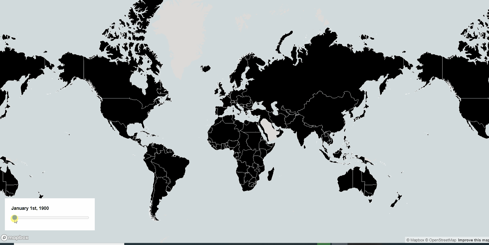

# A Map of History of International Borders
[Live](https://bhch7051.github.io/Changing-International-Borders/#2/29/25)

This is an interactive map visualising the history of international borders. The data is from [CShapes](https://icr.ethz.ch/data/cshapes/)
### Preview

